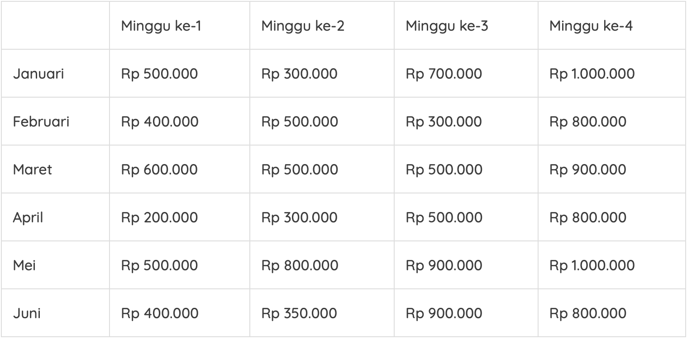
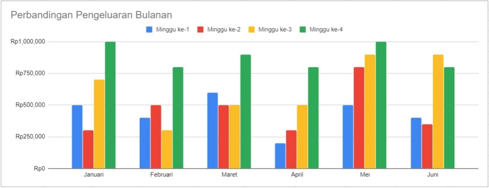

# Introduction 

Visualisasi data merupakan cara mengomunikasikan sebuah informasi atau data dalam bentuk visual seperti diagram, grafik, atau representasi visual lainnya.

Mengapa Menggunakan Visualisasi Data?

>“Un bon croquis vaut mieux qu’un long discours” (Napoleon, Kaisar Perancis)
>
>“Sketsa yang bagus lebih baik daripada pidato yang panjang”

Sketsa yang dimaksud ibarat data yang kita visualisasikan dengan baik sehingga bisa dipahami banyak orang. 

Visualisasi data dapat menyampaikan informasi tabel ribuan baris dan kolom dengan jauh lebih efektif, dibandingkan dengan hanya tulisan.

Contoh bila ingin secara cepat menyampaikan informasi pengeluaran terbesar:

Dibandingkan dengan:

## Media Visualisasi Data

### Tabel

Tabel merupakan salah satu media visualisasi data yang sederhana dan sering kita temukan. 

Data dalam tabel biasanya dikategorikan dalam baris atau kolom tertentu yang kemudian dapat diurutkan dengan mudah misal diurutkan secara menaik (Ascending) atau menurun (Descending). Hal tersebut memudahkan kita untuk menyusun data sesuai dengan perintah yang diinginkan. 

Terdapat beberapa aturan dasar dalam penulisan tabel yaitu sebagai berikut:

* Penulisan judul
Dalam menulis judul pastikan sudah mencakup isi dari tabel kita. Usahakan menggunakan font yang jelas dan mudah dibaca. Pembaca jadi paham tabel apa yang tersaji.

* Simpel
Simplicity is a must (kesederhanaan adalah suatu keharusan). Jangan terlalu berlebihan dalam mendesain sebuah tabel. Akibatnya pembaca tidak fokus pada data yang disajikan. Penulisan variabel di dalamnya juga singkat saja.

* Penjelasan Simbol
Apabila dalam tabel terdapat simbol atau istilah tertentu, Anda dapat menjelaskannya pada catatan kaki tabel tersebut.

* Penekanan
Penekanan yang dimaksud adalah cara kita memfokuskan perhatian pembaca pada pokok data. Misal, dalam penulisan tabel di atas, nama buah menggunakan warna background biru supaya pembaca bisa mudah membedakan nama buah dan jumlah buah. Jika suatu data ada dalam kategori yang sama dan dapat dijumlahkan, maka Anda dapat menyertakan total di akhir datanya seperti contoh tabel di atas.

* Sumber Tabel
Apabila tabel yang disajikan bukan milik Anda, maka sertakan sumber di catatan kaki tabel tersebut.

## Diagram

### Diagram Batang

Jumlah elemen batang dari diagram ini sebaiknya tidak terlalu banyak supaya label dari data tersebut masih bisa terbaca atau tidak terpotong. 

Sumbu X pada diagram batang menunjukkan kategori data sedangkan sumbu Y menunjukkan skala nilai dari data dalam satuan ukuran tertentu. Pastikan pada sumbu Y nilai awalnya adalah 0 supaya diagram Anda terlihat akurat dan mengurangi kesalahpahaman dalam mengartikan data.

Selain itu, perhatikan pula penulisan label diagram. Hindari penulisan label secara vertikal maupun diagonal supaya tidak menyulitkan pembaca dalam memahami label tersebut. Warna juga penting dalam penyajian data diagram. Usahakan menggunakan warna yang konsisten supaya mudah dipahami.

### Diagram Garis

Diagram garis biasanya menyajikan perubahan data dalam periode waktu tertentu. Secara umum, diagram garis digunakan untuk melihat perkembangan data tertentu yang berlangsung secara terus menerus atau berkelanjutan.

Dalam proses penggambaran diagram garis diperlukan sumbu mendatar atau X dan sumbu tegak atau Y. Masing-masing sumbu memiliki fungsinya sendiri-sendiri. Sumbu X berfungsi untuk menunjukkan interval waktu sedangkan sumbu Y menunjukkan kuantitas atau nilai dari data tersebut seperti total penjualan, biaya yang dikeluarkan, jumlah pendapatan, dan lain sebagainya. 

Kemudian, buat tanda titik koordinat yang menunjukkan nilai data berdasarkan waktunya. Setelah semua data ditandai dengan titik koordinat, maka selanjutnya buatlah garis yang menghubungkan titik-titik tersebut. Dari penarikan garis tersebut kita bisa melihat pola perkembangan datanya cenderung naik, stabil, atau turun. 

### Diagram Lingkaran

Diagram lingkaran mirip seperti sebuah makanan pizza yang diiris dengan porsi tertentu. Pada konteks data, irisan pizza tersebut menggambarkan persentase data nilai atau kuantitas. Ada irisan yang besar dan ada yang kecil semuanya bergantung pada data yang ditampilkan. Apabila irisan tersebut dijumlahkan nilainya, maka seharusnya akan menghasilkan 100 persen atau 360 derajat. 

Diagram lingkaran biasanya sering digunakan oleh perusahaan atau dunia pendidikan untuk merepresentasikan data. Diagram lingkaran tidak hanya menunjukkan jumlah relatif dari kuantitas suatu data satu sama lain, namun dapat menunjukkan keseluruhan data dan kuantitas sebuah kategori data itu sendiri relatif vis a vis atau berhubungan dengan keseluruhan data yang ada. 

Dalam proses pembuatan diagram lingkaran terdapat beberapa aturan dasar yang perlu diperhatikan. 

Sama seperti diagram garis dan batang, pastikan terdapat judul pada diagram lingkaran yang Anda buat. 

Apabila Anda membuat diagram lingkaran dalam satuan persen maka pastikan jumlah total datanya adalah 100%, sedangkan untuk satuan derajat totalnya adalah 360 derajat. 

Kemudian penulisan label juga penting untuk penanda dari suatu data, bisa menunjukkan kategori data, nilai, ataupun keduanya. 

Selanjutnya buat setiap warna irisannya berbeda untuk membedakan datanya. Yang paling penting, usahakan data yang Anda gambarkan dalam diagram maksimal 5 irisan supaya tidak menyulitkan pembaca. Selain itu juga tidak menimbulkan bias antara data satu dengan yang lainnya.

## Visualisasi Data dalam Bisnis

### Scorecard

Scorecard merupakan sebuah visualisasi yang fokus pada sebuah jenis data yang spesifik. Sehingga biasanya terdiri dari 1 bentuk visualisasi saja. Visualisasinya dapat berfokus pada jumlah pendapatan, kepuasan pelanggan, dan hal lainnya yang dapat dibandingkan dengan target yang telah ditentukan. Scorecard dapat juga menggambarkan tentang salah satu Key Performance Indicators (KPI) perusahaan yang lebih disederhanakan untuk dapat memantau kemajuan progres.

### Dashboard

Dashboard merupakan kumpulan dari berbagai macam visualisasi yang menggabungkan dan merangkum informasi atau data bisnis. Kumpulan beberapa scorecard juga dapat disebut sebagai sebuah dashboard. 

Sebelum mendesain sebuah dashboard, Anda harus menentukan terlebih dahulu apa saja yang ingin diceritakan dalam dashboard itu. Saat kerangka dashboard sudah dibuat, Anda dapat mengisinya dengan berbagai visualisasi yang relevan seperti diagram garis, batang, lingkaran, dan berbagai metode visualisasi lainnya. Biasanya terdapat kombinasi empat visualisasi data yang saling berhubungan satu sama lain.

### Report

Report atau laporan merupakan suatu bentuk penyampaian berita, keterangan, pemberitahuan, ataupun pertanggungjawaban sebagai bentuk pelaksanaan komunikasi dari pihak yang satu kepada pihak yang lainnya. 

Report yang baik, menggunakan visualisasi data untuk membuat ringkasan dari apa yang terjadi di perusahaan dalam waktu tertentu sehingga dapat digunakan untuk memahami hal yang sedang terjadi dari suatu perusahaan dengan secepat mungkin.

### Analytic Report

Analytic report adalah laporan yang berfokus pada analisis yang digunakan untuk menentukan keputusan. Jenis laporan ini menggunakan data kualitatif dan kuantitatif untuk menganalisis dan mengevaluasi ide dari suatu bisnis. 

Analytic report memberikan keuntungan untuk pembaca karena memberi pemahaman yang mudah dipahami. Selain itu hanya dengan membaca sekilas saja, pembaca juga dapat memahami data dalam jumlah yang banyak. Analytic report juga menerapkan langkah-langkah umum seperti mengidentifikasi masalah, menentukan metode yang tepat, analisis data, dan mendapatkan solusi terbaik dari masalah yang dihadapi.

## Tools dalam Visualisasi Data

### Tableau Public

Tableau Public merupakan sebuah layanan gratis yang memungkinkan siapa saja dapat mempublikasikan visualisasi data ke dalam web. Visualisasi yang telah dipublikasikan ke Tableau Public ("vizzes") dapat diletakkan dalam halaman web dan blog, dibagikan ke sosial media, dan juga dapat juga diunduh oleh pengguna lainnya. 

Untuk proses pembuatan visualisasi datanya sendiri menggunakan aplikasi terpisah bernama [Tableau Desktop Public Edition](https://public.tableau.com/en-us/s/).

### Google Sheets

Google Sheets menawarkan kumpulan fitur dan fungsi standar spreadsheet application seperti yang ada di Microsoft Excel. Tentunya pada Google Sheets dapat membuat visualisasi sederhana dari data yang kita buat baik dalam bentuk diagram batang, diagram garis, maupun diagram lingkaran.

### Microsoft Excel

Microsoft Excel menggunakan spreadsheet yang terdiri dari baris dan kolom untuk manajemen data serta melakukan perhitungan fungsi yang lebih akrab disebut formula. 

Selain melakukan perhitungan angka yang bersifat numerik, Excel juga dapat membuat visualisasi data sederhana ke dalam bentuk grafik seperti diagram garis, batang, lingkaran, dan lain-lain.

## Konteks Data

Data bisa dikatakan sebagai cerminan dari kehidupan nyata. Data yang banyak akan terlihat rumit dan sulit dipahami. 

Namun, apabila Anda menemukan konteks (makna inti) dari data tersebut setidaknya Anda dapat menemukan sebuah cara yang tepat untuk memahaminya. Maka dari itu apabila kita memiliki data tanpa memahami konteks, bisa saja data tersebut tidak bisa tersampaikan dengan baik. 

Penting untuk mengetahui audiens (siapa yang nanti membaca data atau visualisasi) untuk menentukan bagaimana cara menyampaikan data. Selanjutnya Anda juga harus bertanya pada diri sendiri, “Apakah mereka perlu tahu dan apakah Anda ingin mereka jadi tahu?” Hal ini harus bisa Anda jawab terlebih dahulu sebelum menyampaikan data kepada audiens. Apabila pertanyaan tersebut belum terjawab, maka bisa saja Anda malah menyampaikan hal-hal yang menurut mereka tidak perlu dan menjadi kurang relevan.

Pertanyaan penting yang juga harus ditanyakan ke diri sendiri adalah, “Bagaimana saya bisa menentukan poin penting dan membuat data tersampaikan secara efektif?” Bayangkan data Anda berupa kanvas, dan Anda sebagai seorang pelukis. Apa pun yang akan Anda lukis pada kanvas itulah yang akan dilihat oleh orang lain. Lalu, sebagai seorang pelukis, ada beberapa hal yang perlu dipikirkan, 

* Untuk siapa lukisan ini dibuat?
* Apa yang ingin dilukis?
* Bagaimana cara melukiskannya?

Poin-poin pertanyaan di atas, apabila dilakukan oleh seorang Data Analyst menjadi seperti berikut:

* Kepada siapa data ini akan disampaikan?
* Data apa yang ingin disampaikan?
* Bagaimana cara menyampaikan data tersebut?

### Kepada siapa data ini akan disampaikan?

Sebelum menyampaikan sebuah data, kita harus mengetahui dulu siapa audiens yang akan kita hadapi. Hal ini penting untuk membuat proses penyampaian data lebih efektif dan bisa diterima oleh audiens. Anda harus bisa membedakan penyampaian data antara audiens umum dan yang sudah profesional (sudah ahli di bidangnya). 

Apabila mayoritas berupa audiens umum, bukan berarti kita bisa menganggap semuanya masih pemula. Bisa saja di antara mereka ada salah satu audiens profesional, maka dari itu kita harus mengambil titik tengah dalam hal penyampaian data yaitu dengan penyampaian yang mudah dipahami namun tidak mengurangi detail dari data. Lain ceritanya jika kita membawakan data kita dengan audiens yang rata-rata sudah profesional. Maka harus benar-benar diperhatikan setiap detail dari data yang kita bawakan karena pasti audiens lebih kritis dalam memahami apa yang kita sampaikan.

### Data apa yang ingin saya sampaikan?

Supaya data relevan dengan audiens, Anda harus menyaring terlebih dahulu data yang dimiliki. Hal ini untuk membuat audiens dapat menentukan langkah selanjutnya seperti apa yang harus dilakukan audiens setelah mengetahui data yang disampaikan. 

Misal, Anda diminta untuk mempresentasikan data tentang perkembangan penjualan perusahaan dalam setahun terakhir pada sebuah rapat. Namun audiens berupa tim penjualan khusus untuk produk televisi. Maka Anda dapat mengumpulkan data yang khusus berhubungan dengan penjualan televisi, total produksi barang televisi, dan lain sebagainya. Sehingga audiens yang ada dalam rapat tersebut dapat cepat mengambil keputusan untuk apakah mereka perlu menambah atau mengurangi produksi barang.

### Bagaimana cara menyampaikan data tersebut?

Metode penyampaian juga perlu diperhatikan. Misal, terdapat kondisi di mana sebagian besar audiens tidak terbiasa dengan data dalam bentuk angka. Maka, kita dapat menggunakan metode seolah kita sedang bercerita dengan berdasar pada data yang kita sampaikan. Sehingga cara kita membawakan data tidak seperti membaca. Tugas kita sebagai presenter yang membawakan data tersebut adalah memperjelas setiap bagian dengan bumbu cerita pada beberapa elemen data yang ada. 

Misal, penjualan novel dengan judul A pada bulan Juni 2019 meningkat sebanyak 25% dibanding bulan sebelumnya. Nah, di sini Anda jangan terlalu datar dengan menyampaikan jumlah peningkatannya saja. Namun, Anda dapat bercerita tentang apa yang melatarbelakangi peningkatan tersebut. Misal kita membawakan dengan narasi sebagai berikut:

“Film A yang ditayangkan bulan Februari 2019 lalu mengundang antusias yang tinggi bagi penonton film tanah air. Bahkan beberapa sumber mengatakan jutaan tiket bioskop ludes terjual dalam waktu sehari saja dari total keseluruhan penonton di Indonesia. Hal tersebut dikarenakan film A merupakan adaptasi dari novel yang sangat terkenal. Sehingga pada bulan Februari penjualan total tiket meningkat sebanyak 25% dibanding bulan sebelumnya.”

Narasi di atas akan lebih dapat dimengerti oleh audiens tersebut daripada hanya membaca angka seperti berikut:
“Penjualan total tiket bulan Januari: 900 ribu. 
Penjualan total tiket bulan Februari: 1.125 juta.”